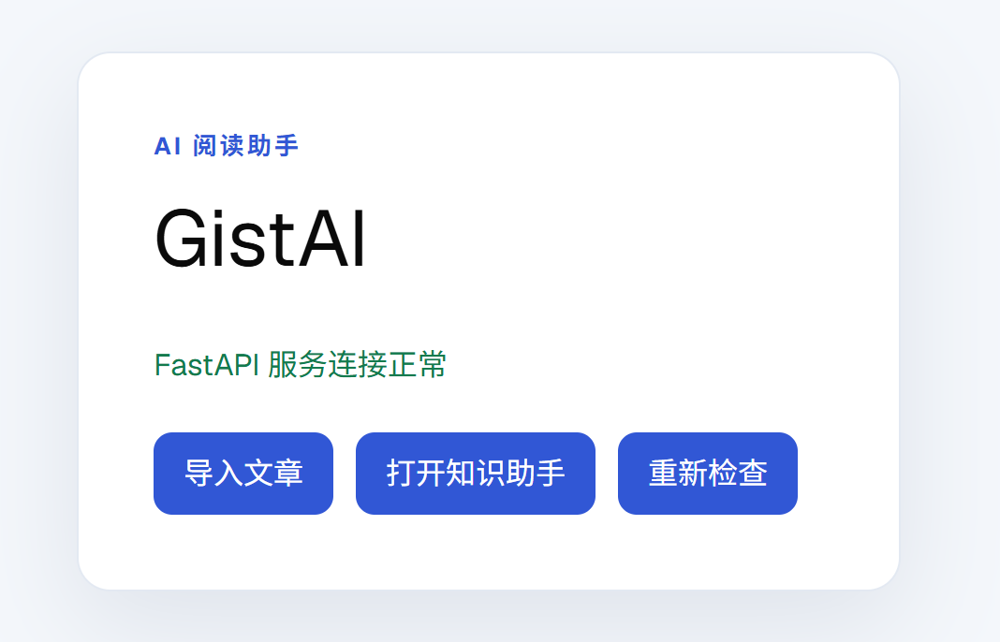
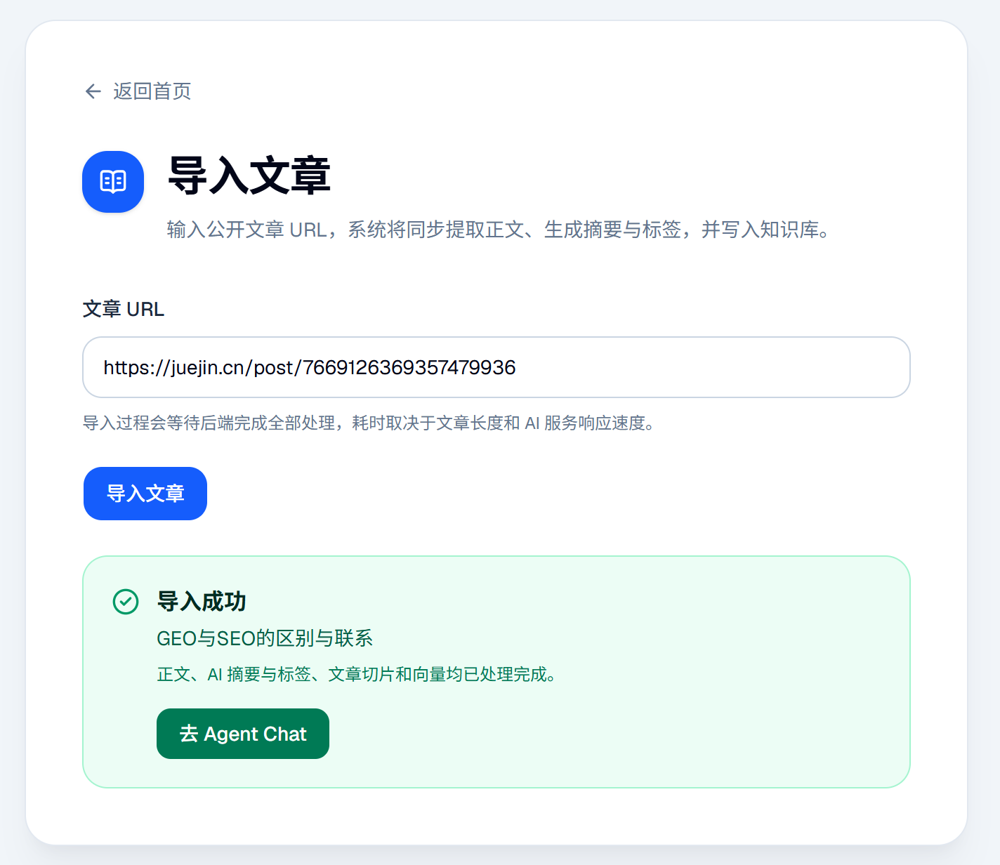
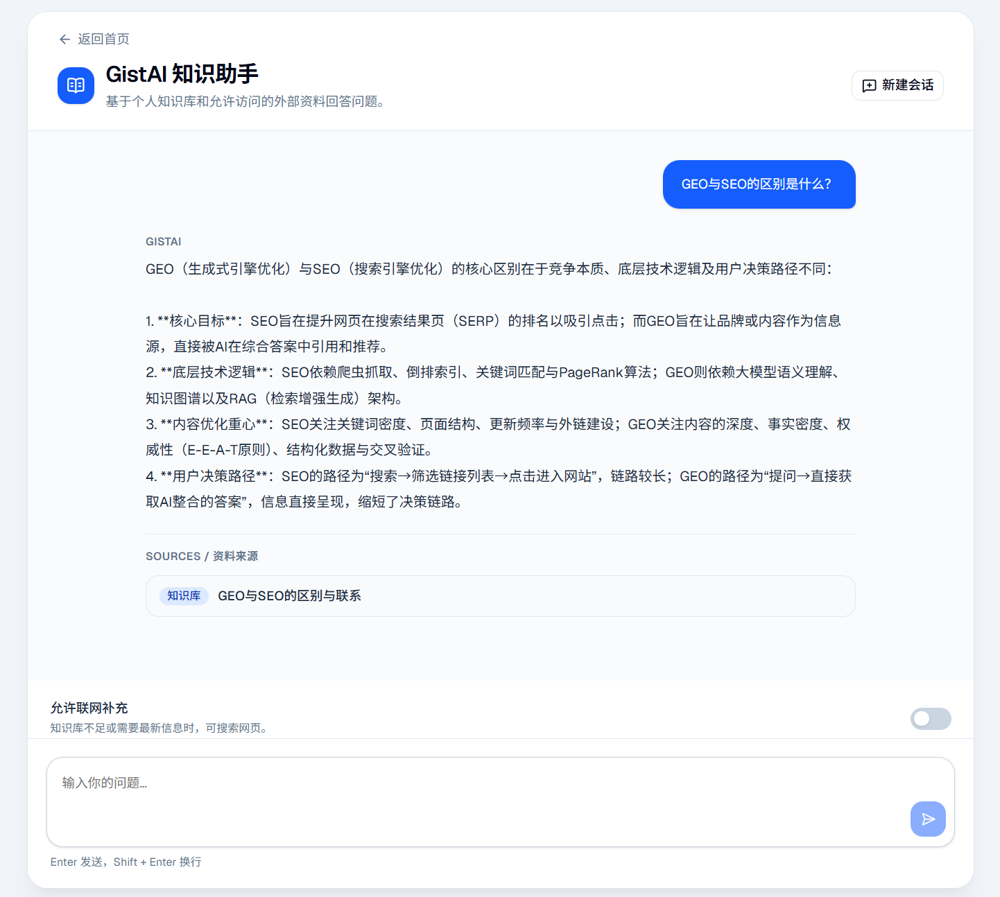
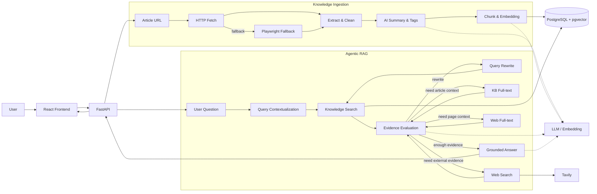

# GistAI

一个面向个人知识管理场景的 AI 阅读助手。

GistAI 可以把网页文章抓取、清洗、摘要并写入个人知识库，再通过语义检索和 Agentic RAG 完成基于证据的问答。对于需要最新信息的问题，也可以在用户允许的情况下调用 Web Search，并继续读取网页全文补充证据。

> 核心设计原则：确定性强的流程保持普通 Workflow；需要运行时判断的知识使用过程交给 Agent。

---


## Screenshots

### 首页



### 文章导入

从公开文章 URL 开始，完成正文提取、AI 摘要与标签、Chunk 和 Embedding，并写入知识库。



### 知识助手

基于个人知识库进行问答，并展示实际使用到的 KB / Web Sources。



---

## Features

- URL 导入文章
- HTTP 抓取 + Playwright fallback
- 正文提取与清洗
- AI 摘要、核心观点与标签
- Token Chunking + Embedding
- PostgreSQL + pgvector
- Keyword Search / Semantic Search
- Basic RAG
- 多轮 Agent Chat
- Query Contextualization
- Query Rewrite
- Controlled Web Search
- KB / Web Full-text Reading
- Evidence Selection
- Runtime Policy / Tool Budget
- PostgreSQL Conversation Checkpoint
- KB / Web Sources 展示

---

## Architecture

GistAI 分为两条核心链路：

- **Knowledge Ingestion**：把外部文章转成可检索的个人知识。
- **Agentic RAG**：根据用户问题和当前证据，决定搜索、改写 Query、读取全文、联网补充或直接回答。



程序负责权限、工具预算、合法 Action 和终止条件；LLM 只在允许范围内做语义判断。

---

## Tech Stack

### Frontend

- React
- TypeScript
- Vite
- React Router
- TanStack Query
- axios
- Tailwind CSS
- shadcn/ui

### Backend

- Python
- FastAPI
- Pydantic
- SQLAlchemy 2
- Alembic
- PostgreSQL
- pgvector
- LangGraph

### AI & Retrieval

- OpenAI-compatible LLM API
- Qwen 系列模型
- `text-embedding-v4`
- Semantic Search
- Structured Output
- Query Rewrite
- Evidence Selection
- Tavily Web Search

### Fetching

- HTTP
- trafilatura
- Playwright
- SSRF Protection

---

## Project Structure

```text
GistAI/
├─ apps/
│  ├─ web/          # React frontend
│  └─ server/       # FastAPI backend
├─ docs/
├─ infra/
├─ docker-compose.yml
├─ .env.example
└─ README.md
```

---

## Quick Start

以下命令以 Windows PowerShell 为例。

### 1. Start PostgreSQL

在项目根目录执行：

```powershell
docker compose up -d postgres
docker compose ps
```

正常情况下可以看到：

```text
gistai-postgres
healthy
```

本地数据库默认配置：

```text
Host:     localhost
Port:     5432
Database: gistai
Username: gistai
Password: gistai
```

### 2. Run Database Migration

```powershell
cd apps/server
.\.venv\Scripts\python.exe -m alembic upgrade head
.\.venv\Scripts\python.exe -m alembic current
```

### 3. Start Backend

在 `apps/server` 目录执行：

```powershell
.\.venv\Scripts\python.exe -m uvicorn app.main:app --reload --host 127.0.0.1 --port 8000
```

FastAPI Swagger:

```text
http://127.0.0.1:8000/docs
```

### 4. Start Frontend

回到项目根目录：

```powershell
npm run dev:web
```

访问：

```text
http://localhost:8088/
```

---

## Environment

完整功能依赖以下外部服务：

- PostgreSQL + pgvector
- OpenAI-compatible LLM API
- Embedding API
- Tavily API Key
- Playwright / Chromium

其中：

- PostgreSQL 用于业务数据、Vector Search 和 Agent Checkpoint
- LLM 用于摘要、Query Rewrite、Evidence Evaluation 和最终回答
- Embedding 用于文章和 Query 向量化
- Tavily 用于 Web Search
- Playwright 用于普通 HTTP 抓取失败后的浏览器 fallback

实际环境变量请参考项目中的 `.env.example`。

---

## Agent Design

### Evidence-driven Decision

```text
Retrieval Results
↓
Evidence Evaluation
↓
Selected Evidence
↓
Answer
```

核心原则：

> Retrieval Success ≠ User Goal Satisfied

如果当前 Chunk 或 Search Snippet 不足以回答问题，Agent 可以继续执行 Query Rewrite、全文读取或 Web Search。

### Controlled Web Search

系统区分：

```text
allow_web
= 是否允许联网

requires_freshness
= 当前问题是否要求最新证据
```

当问题明确要求“今天”“最新”“当前”等时，如果用户允许联网且预算可用，系统会优先补充 Web Evidence。

### Bounded Agent Loop

Agent 不允许无限调用工具。

当前主要限制：

```text
MAX_KB_SEARCHES    = 2
MAX_REWRITES       = 1
MAX_WEB_SEARCHES   = 1
MAX_ARTICLE_READS  = 2
MAX_WEB_PAGE_READS = 2
MAX_STEPS          = 8
```

程序负责权限、预算、合法 Action 和终止条件；LLM 只在允许范围内做语义判断。

---

## Reliability & Security

项目包含以下工程保护：

- SSRF 防护
- localhost / Private IP 拦截
- Redirect 逐跳校验
- Playwright 导航安全控制
- Structured Output
- Pydantic Validation
- Runtime Business Validation
- Transaction
- Atomic Replacement
- Error Classification
- User / Thread Isolation
- PostgreSQL Checkpoint

文章重新处理和 Embedding 重建会先完整准备新结果，再通过事务替换旧数据，避免中途失败破坏已有有效数据。

---

## API

Agent Chat:

```text
POST /api/v1/agent/chat
```

Request:

```json
{
  "message": "用户当前问题",
  "thread_id": "可选 UUID"
}
```

Response:

```json
{
  "thread_id": "UUID",
  "answer": "回答内容",
  "status": "answer | partial | insufficient | error",
  "sources": []
}
```

前端每轮只发送当前消息和 `thread_id`，会话状态由后端 PostgreSQL Checkpoint 维护。

---

## Tests

最近一次完整验证结果：

```text
Agent tests:                116 passed
Agent API tests:              6 passed
Checkpoint integration:       5 passed
Semantic / RAG / Fetch:      69 passed
Full backend:               308 passed

Frontend production build: passed
Python compileall:          passed
pip check:                  passed
git diff --check:           passed
```

实际验证覆盖过：

- KB Search → Answer
- KB Search → Full-text → Answer
- Follow-up Query Contextualization
- No-Web 场景
- Freshness → Web Search
- Web Search → Web Full-text → Answer
- Article Import → Embedding → Agent Retrieval
- PostgreSQL Checkpoint 跨实例恢复

---

## Current Scope

当前实现是一个 **single-agent、bounded、evidence-driven Agentic RAG system**。

暂未包含：

- Long-term Memory
- Cross-conversation Memory
- Conversation History / Rename / Delete UI
- Streaming / SSE / WebSocket Chat
- Multi-Agent
- Planner / Reflection
- Reranker
- Web 内容自动保存
- Agent Analytics Dashboard

这些能力会根据后续真实产品需求决定是否加入。

---

## Status

```text
Knowledge Ingestion        ✅
Keyword / Semantic Search  ✅
Basic RAG                  ✅
Agentic RAG                ✅
Controlled Web Search      ✅
Full-text Reading          ✅
Runtime Policy / Budget    ✅
PostgreSQL Checkpoint      ✅
Agent HTTP API             ✅
Frontend Chat              ✅
Core Behavior Validation   ✅
```
