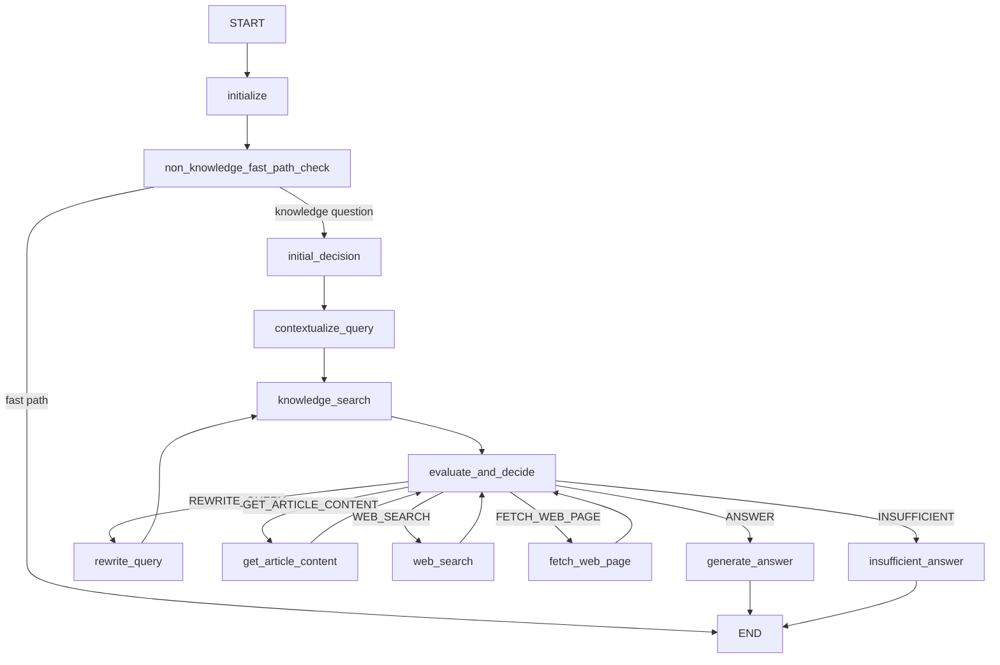

# Agent Design

GistAI 的 Agent 用于解决一个核心问题：

> 当一次知识库检索不足以回答用户问题时，系统应该如何判断下一步。

相比固定的 Basic RAG，Agent 可以根据当前证据和运行边界继续执行 Query Rewrite、读取知识库全文、Web Search 或读取网页全文，并在证据足够时结束。

---

## Graph Flow



---

## Agent State

`AgentState` 继承自 LangGraph `MessagesState`，并保存 Agent 执行过程中需要演进和持久化的数据。

### Query

```text
original_query
current_query
```

`original_query` 保存用户原始问题；`current_query` 可以在 Query Rewrite 后变化。

### Intent & Web Policy

```text
intent
allow_web
allow_web_override
requires_freshness
```

`allow_web` 表示本轮是否允许使用 Web Search；`requires_freshness` 表示问题是否需要最新外部证据。

### Retrieval & Full-text

```text
kb_results
web_results
article_contents
web_page_contents
article_fulltext_evidence
web_fulltext_evidence
```

Search Result 和 Full-text Evidence 分开保存，避免把“搜到结果”直接视为“证据充分”。

### Decision & Budget

```text
selected_evidence
evidence_status
rewrite_count
step_count
tool_call_counts
allowed_actions
next_action
```

这些字段支持 Evidence-driven Decision 和 bounded loop。

---

## Runtime Context

运行时依赖通过 `AgentContext` 注入，而不是写入 `AgentState`。

当前 Runtime Context 包括：

- Knowledge Search Provider
- Web Search Provider
- Reasoning Provider
- Article Content Provider
- Web Page Fetch Provider
- Full-text Evidence Selector
- Runtime Policy

设计目的：

```text
AgentState
= 可演进、可 checkpoint 的 execution state

AgentContext
= 当前运行需要的依赖
```

数据库连接、Service、Provider、API Client 等对象不应该被持久化进 Checkpoint。

---

## Evidence-driven Decision

核心决策链：

```text
Retrieval Results
↓
Evidence Evaluation
↓
Selected Evidence
↓
Action
```

Agent 不只判断“有没有结果”，而是判断“这些结果是否足以支撑回答”。

如果不足，可以继续：

- `REWRITE_QUERY`
- `GET_ARTICLE_CONTENT`
- `WEB_SEARCH`
- `FETCH_WEB_PAGE`
- `INSUFFICIENT`

这使系统可以在“相关但不充分”的检索结果上继续工作。

---

## Query Contextualization

多轮聊天中，用户可能只输入：

```text
那第二阶段呢？
```

直接对该句做向量检索往往缺少上下文。

因此在 Search 之前，系统先结合 conversation 将当前问题转换成可独立检索的 Query：

```text
Conversation Context
+
Current Message
↓
Contextualized Query
↓
Knowledge Search
```

前端不需要重复上传完整历史，历史由 Checkpoint 提供。

---

## Query Rewrite

如果第一次检索未得到足够证据，可以进行一次 Query Rewrite。

Rewrite 只修改当前工作 Query，不覆盖用户原始问题。

```text
original_query
= user intent

current_query
= retrieval query
```

当前 Rewrite Budget：

```text
MAX_REWRITES = 1
```

这样保留自我修正能力，同时避免无界循环。

---

## Controlled Web Search

Web Search 是受控能力，不是默认无限 fallback。

系统区分：

```text
allow_web
requires_freshness
```

当问题需要最新信息，并且：

```text
requires_freshness = true
allow_web = true
Web budget available
no verified Web evidence yet
```

Runtime Policy 可以要求优先完成一次 Web Search。

这避免模型在明确要求时效性的场景中，仅凭知识库或模型参数知识作答。

---

## Full-text Reading

Search Result 通常只是 Chunk 或 Web snippet。

当这些内容不足时：

```text
KB Result
→ Article Full-text
→ Temporary Selection
→ Evidence Evaluation
```

或者：

```text
Web Result
→ Fetch Page
→ Full-text
→ Temporary Selection
→ Evidence Evaluation
```

全文不会长期无限制地进入 Agent Context 或 Checkpoint。系统只保留当前回答需要的精选证据，并受 Context Budget 约束。

---

## Runtime Policy

`AgentRuntimePolicy` 是模型和工具之间的程序边界。

默认预算：

```text
MAX_KB_SEARCHES    = 2
MAX_REWRITES       = 1
MAX_WEB_SEARCHES   = 1
MAX_ARTICLE_READS  = 2
MAX_WEB_PAGE_READS = 2
MAX_STEPS          = 8
```

Policy 根据当前 State 计算：

```text
allowed_actions
termination decision
```

节点执行 Action 前还会再次经过程序校验。

因此 LLM 不能自行：

- 增加预算
- 绕过 Web 权限
- 无限制 Rewrite
- 无限制调用 Tool
- 绕过 Global Step Limit

---

## Termination

Agent 允许三类业务结果：

```text
answer
partial
insufficient
```

当预算耗尽或发生不可恢复错误时：

- 已有可靠 Evidence：可以返回 Partial Answer
- 没有可靠 Evidence：返回 Insufficient

这比为了“完成任务”而强制生成一个看似完整的答案更符合 evidence-driven 设计。

---

## Checkpoint

生产运行使用 PostgreSQL `PostgresSaver`。

Checkpoint 负责：

- conversation state persistence
- multi-turn continuation
- process / graph instance recreation 后恢复同一 thread

连接池和 Checkpointer 由应用生命周期统一管理。

Checkpoint serializer 使用明确的类型 allowlist；Runtime Dependency、API Key、数据库 Session 和大块全文内容不作为持久化运行对象使用。

---

## Why Single Agent

当前系统使用 single-agent architecture。

原因是当前问题空间主要是：

```text
Search
→ Evaluate
→ Choose Next Action
→ Answer
```

这类流程通过一个 bounded decision loop 已经可以表达。

Multi-Agent、Planner / Reflection 等能力只有在真实任务复杂度需要时才值得引入，否则会增加状态同步、调试和评估成本。
