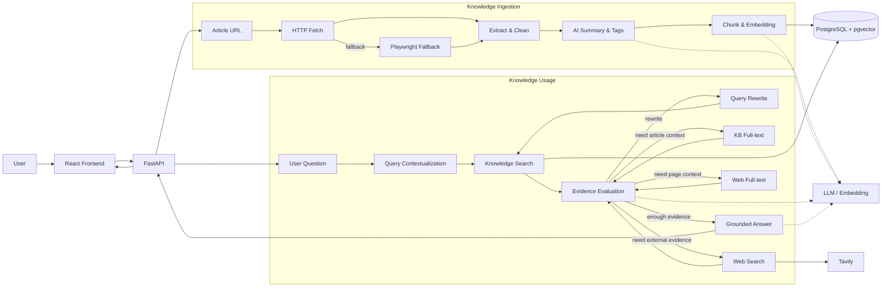

# GistAI Architecture

GistAI 是一个面向个人知识管理场景的 AI 阅读助手。系统围绕两条主链路展开：

1. **Knowledge Ingestion**：把网页文章转化为可检索、可引用的个人知识。
2. **Agentic RAG**：根据用户问题和当前证据，在知识库检索、Query Rewrite、全文读取和 Web Search 之间做受控决策。

项目没有把所有流程都 Agent 化。抓取、清洗、摘要、Chunk、Embedding 等确定性较强的步骤继续使用普通 Workflow / Service；只有知识使用侧需要运行时语义判断的部分交给 Agent。

---

## System Overview



---

## Main Components

### Frontend

前端基于 React + TypeScript，负责文章 URL 导入、Agent Chat、多轮会话、New Chat、KB / Web Sources 展示，以及是否允许联网的用户控制。

前端只维护当前 UI 状态和公开的 `thread_id`。多轮会话历史不需要每次完整回传给后端。

### FastAPI Backend

后端提供 Article API、Search API、Basic RAG API 和 Agent Chat API，并承载抓取、AI、Embedding、检索和 Agent Service。

API 层负责输入输出契约；业务 Service 负责确定性能力；LangGraph 负责 Agent orchestration。

### PostgreSQL + pgvector

PostgreSQL 同时承载：

- Article / Tag / Chunk 等业务数据
- pgvector 语义检索
- LangGraph PostgreSQL Checkpoint

业务数据和向量存储在同一套数据库中，降低了跨存储同步和事务补偿的复杂度。

---

## Knowledge Ingestion

文章入库主链路：

```text
Article URL
↓
URL Safety Validation
↓
HTTP Fetch
↓ failure
Playwright Fallback
↓
Extract
↓
Clean
↓
AI Summary / Key Points / Tags
↓
Chunk
↓
Embedding
↓
PostgreSQL + pgvector
```

### HTTP First, Browser Fallback

普通 HTTP 抓取开销更低，因此优先使用 HTTP。对于依赖 JavaScript 渲染、普通 HTTP 无法获得有效正文的页面，再使用 Playwright + Chromium 作为 fallback。

### Structured AI Processing

正文处理完成后，通过 LLM 生成结构化结果，例如 one-sentence summary、key points、detailed summary 和 tags。模型结果需要通过结构化 Schema 和应用层校验后才能进入数据库。

### Chunk & Embedding

当前默认配置：

```text
chunk_size = 400
chunk_overlap = 80
embedding_dimension = 1024
```

Chunk 被写入 `article_chunks`，并保存对应 Embedding，用于后续 Semantic Search 和 RAG。

---

## Knowledge Usage

知识使用侧从固定的 Search → Answer 流程扩展为可决策流程：

```text
Question
↓
Contextualize Query
↓
Knowledge Search
↓
Evaluate Evidence
↓
Answer / Rewrite / Full-text / Web Search / Insufficient
```

核心区别是：搜索得到候选结果，不等于当前证据已经足以回答问题。Agent 会根据证据质量和当前允许的能力选择下一步。

---

## Agent Boundary

GistAI 将模型能力限制在程序定义的边界内。

程序负责：

- 是否允许联网
- 当前可执行哪些 Action
- Tool Budget
- Global Step Limit
- Tool 参数合法性
- 终止条件
- 错误边界

LLM 负责：

- Query Contextualization
- Evidence Evaluation
- Query Rewrite
- Action Selection
- Final Answer Generation

这种分工使 Agent 保留语义判断能力，同时避免把权限、预算和安全边界交给模型本身。

---

## Conversation Persistence

Agent Chat 使用 `thread_id` 关联会话。

```text
Frontend
↓ current message + thread_id
Agent API
↓
LangGraph
↓
PostgreSQL Checkpointer
```

Checkpoint 用于恢复同一 conversation 的执行状态。它不是 Long-term Memory：当前实现关注同一会话的状态恢复，不负责跨会话长期记忆用户事实或偏好。

---

## Design Principles

- Deterministic workflow stays deterministic.
- Agent is used where runtime semantic decisions are valuable.
- Retrieval result and answer evidence are treated as different concepts.
- Program controls permissions, budgets and termination.
- Agent loops are bounded.
- No reliable evidence means the system may return Partial / Insufficient instead of fabricating completion.
- Runtime dependencies are separated from persistent Agent State.
- Large raw content has a short lifecycle; selected evidence is kept within controlled context limits.
